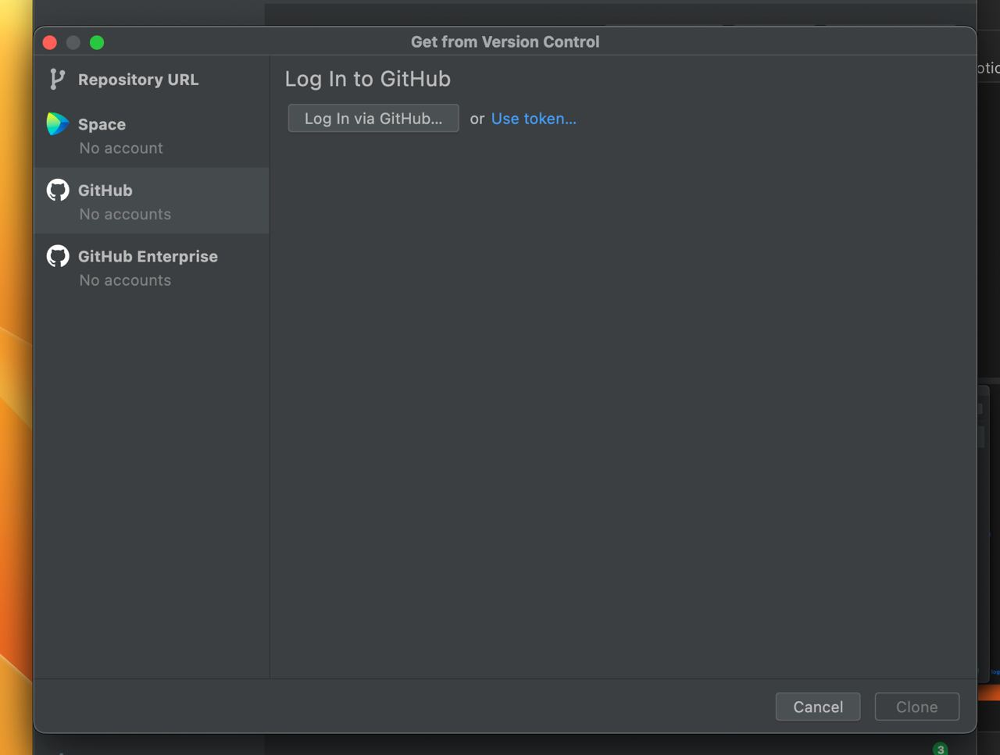
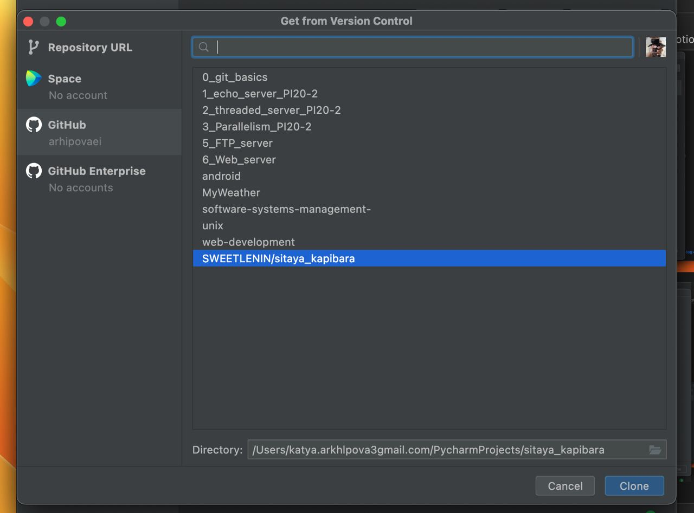
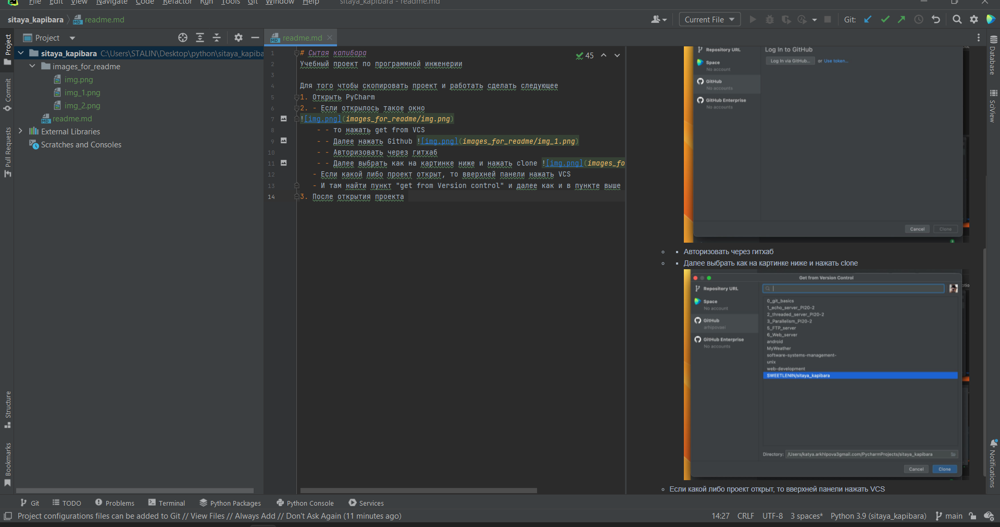
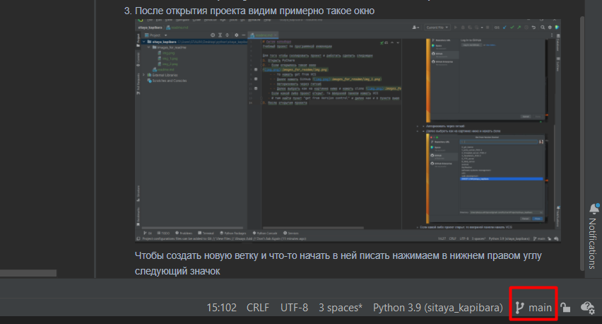
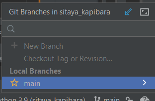

# Сытая капибара
Учебный проект по программной инженерии
- Архипова Е
- Филатова Анна

Для того чтобы скопировать проект и работать сделать следующее
1. Открыть PyCharm
2. - Если открылось такое окно

    - - то нажать get from VCS
    - - Далее нажать Github 
    - - Авторизовать через гитхаб
    - - Далее выбрать как на картинке ниже и нажать clone 
   - Если какой либо проект открыт, то вверхней панели нажать VCS
   - И там найти пункт "get from Version control" и далее как и в пункте выше
3. После открытия проекта видим примерно такое окно 
Чтобы создать новую ветку и что-то начать в ней писать нажимаем в нижнем правом углу следующий значок(на скриншоте в красном квадрате)

4. Видим такое и нажимаем ЛКМ по main 
5. Нажимаем "New Branch from main"
6. Называем ветку с функционалом, который будет выполняться в ней и нажимаем create
7. Все можно работать!