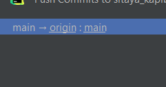

# Сытая капибара
Учебный проект по программной инженерии

Командна:
- Архипова Е
- Филатова Анна
- Корнеев Ярослав

Для того чтобы скопировать проект и работать сделать следующее
1. Открыть PyCharm
2. - Если открылось такое окно

    - - то нажать get from VCS
    - - Далее нажать Github 
    - - Авторизовать через гитхаб
    - - Далее выбрать как на картинке ниже и нажать clone 
   - Если какой либо проект открыт, то вверхней панели нажать VCS
   - И там найти пункт "get from Version control" и далее как и в пункте выше
3. После открытия проекта видим примерно такое окно 
Чтобы создать новую ветку и что-то начать в ней писать нажимаем в нижнем правом углу следующий значок(на скриншоте в красном квадрате)

4. Видим такое и нажимаем ЛКМ по main 
5. Нажимаем "New Branch from main"
6. Называем ветку с функционалом, который будет выполняться в ней и нажимаем create
7. Все можно работать!

Для того чтобы запушить изменения делаем следующее 
1. Нажимаем на "commit" далее отмечаем галочками то что мы хотим закомитить
2. Нажимаем "commit", если хотим еще добавить какие то коммиты, или "commit and push" есл закоммитили уже все что хотели и готовы пушить
3. Далее проверяем все ли верно мы пушим, если да, то как на скриншоте не должны быть, т.к. пушить в мейн мы не можем чисто по политикам безопасности. Если все ок, то нажимаем пуш
4. Далее идем на гитхаб
5. Переходим в репозиторий проекта
6. И видим следующую надпись 
7. Нажимаем "compare&pull request"
8. В поле title записываем название пул реквеста, т.е. краткое описание того что делали в данной ветке(например: добавление бэка админки) 
9. В leave a comment описание по желанию и нажимаем create pull request
10. Если хотим что то еще дописывать в этой ветке до мерджа в мейн, то можем просто пушим с пайчарма и все.
